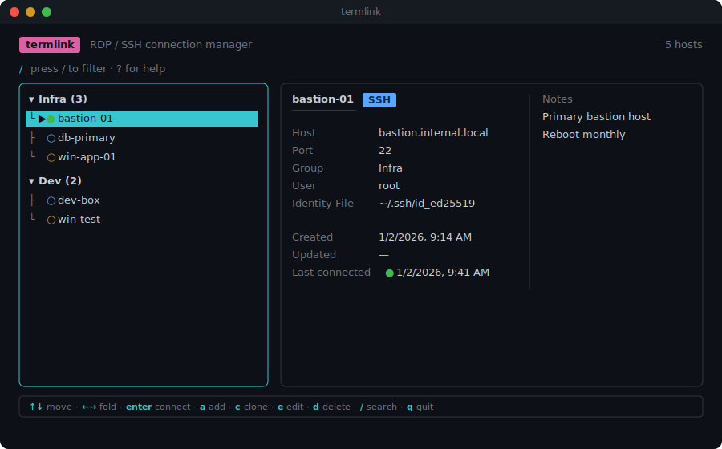

# termlink

A terminal UI for managing your SSH and RDP connections — browse, group, search, and connect without leaving the keyboard.

[](https://github.com/mandrup/termlink/actions/workflows/ci.yml)


[](LICENSE)



## Features

- **Grouped connection list** with fuzzy search, foldable groups, and a live SSH reachability indicator
- **Import from `~/.ssh/config`** — press `i` to pull in your existing hosts; connections use the config alias, so `ProxyJump`, per-host options, etc. keep working
- **ProxyJump / arbitrary ssh flags** via a free-form "Extra SSH Args" field (e.g. `-J bastion.example.com`)
- **SSH** via the real `ssh` binary — your existing config, agent, and host key handling all just work
- **RDP** with no assumed client — writes a standard `.rdp` file and hands it to whatever your OS already knows how to open (`mstsc.exe` on Windows, the registered app on macOS/Linux)
- **RDP passwords**, stored in your OS's native secret store (Keychain / secret-tool / Windows DPAPI) rather than in the config file
- **Optional MCP server** (`termlink-mcp`) for letting AI agents run pre-approved commands on connections you explicitly opt in
- **Per-connection notes**, shown alongside the other fields and editable in a small text area

## Installation

termlink isn't published to a registry yet. Each [release](https://github.com/mandrup/termlink/releases) ships a zip with a prebuilt `dist/index.js` plus everything it needs to run, and an install script (macOS/Linux):

```sh
gh release download --repo mandrup/termlink -p 'termlink-*.zip'
unzip termlink-*.zip
cd termlink-*
./install.sh
```

`install.sh` strips the `com.apple.quarantine` flag macOS puts on browser-downloaded files (which otherwise blocks the bundled native addon from loading), then symlinks `termlink` onto your `PATH` (`~/.local/bin` by default — set `TERMLINK_BIN_DIR` to use somewhere else). On Windows, unzip the release and run `node dist\index.js` directly, or add the extracted folder to your `PATH`.

Or build from source:

```sh
git clone https://github.com/mandrup/termlink.git
cd termlink
npm install
npm run build
npm start
```

Or for a faster feedback loop while developing:

```sh
npm run dev
```

termlink is a terminal UI, so it needs to run in a real terminal (Terminal.app, iTerm2, Windows Terminal, etc.) — not through a piped or non-interactive shell.

## Usage

Run `termlink`, then:

| Key         | Action                         |
| ----------- | ------------------------------ |
| `↑`/`↓`     | Move selection                 |
| `←`/`→`     | Fold/unfold a group            |
| `enter`     | Connect to the selected host   |
| `a`         | Add a connection               |
| `c`         | Clone the selected connection  |
| `e`         | Edit the selected connection   |
| `d`         | Delete the selected connection |
| `i`         | Import from `~/.ssh/config`    |
| `r`         | Recheck SSH reachability       |
| `/`         | Search                         |
| `?`         | Help overlay                   |
| `q` / `esc` | Quit                           |

While adding or editing a connection:

| Key         | Action                                  |
| ----------- | --------------------------------------- |
| `tab` / `↓` | Next field                              |
| `↑`         | Previous field                          |
| `←`/`→`     | Toggle protocol (SSH/RDP) or MCP access |
| `ctrl+s`    | Save                                    |
| `esc`       | Cancel                                  |

## SSH reachability

Each connection's row has one small dot. For RDP it just marks the protocol; for SSH it doubles up: hollow while unchecked or being probed, then filled green if the last check succeeded or red if it failed. All SSH hosts are probed automatically on startup, whenever a new one is added (manually, cloned, or imported), and whenever an existing one's hostname, port, identity file, extra args, or user is edited; press `r` at any time to recheck them all regardless. The probe is the same non-interactive `ssh -o BatchMode=yes ... true` check the MCP server uses, so it never prompts and can't hang on a password. RDP has no non-interactive probe path, so its dot never changes.

## ProxyJump and other ssh flags

The "Extra SSH Args" field on an SSH connection is passed through as-is (split on whitespace, no quoting support) to every `ssh` invocation for that connection — right after `-i` and before the host. Use it for `-J bastion.example.com` to hop through a jump host, `-o StrictHostKeyChecking=no`, port forwarding flags, or anything else not otherwise modeled by termlink.

## Importing from ~/.ssh/config

Press `i` in the connection list to import hosts from `~/.ssh/config`. Each concrete `Host` alias (wildcard and negated patterns are skipped, as are `Match` blocks) becomes an SSH connection named after the alias. The connection's hostname is the **alias itself**, not the resolved `HostName` — connecting runs `ssh <alias>`, so everything in your ssh config (`ProxyJump`, `HostName`, per-host options) still applies exactly as it would from a plain shell. `Port`, `User`, and `IdentityFile` are also copied so they show up in the UI. Aliases that already exist as connections (by name) are skipped, so re-importing after adding new hosts to your config is safe.

## Configuration

Connections are stored as JSON at `$XDG_CONFIG_HOME/termlink/connections.json` (falling back to `~/.config/termlink/connections.json`). Writes are atomic (temp file + rename).

## RDP support

There's no RDP client every platform ships with, so rather than depending on one specific tool, termlink writes a standard `.rdp` file at connect time and asks the OS to open it:

- **Windows** — `mstsc.exe`, which is already installed.
- **macOS** — `open`, which hands off to whatever's registered for `.rdp` files (e.g. Microsoft's free "Windows App").
- **Linux** — `xdg-open`, same idea (e.g. Remmina).

If nothing is registered for `.rdp` files on your machine, install an RDP client and it'll be picked up automatically — termlink itself has no RDP client dependency.

An RDP connection can optionally store a password, kept in your OS's native secret store (Keychain on macOS, `secret-tool`/libsecret on Linux, DPAPI-encrypted storage on Windows) rather than in `connections.json`. At connect time it's written into the temporary `.rdp` file: FreeRDP-derived clients (Remmina, `xfreerdp`) will pick it up automatically, but Microsoft's own clients (`mstsc`, the "Windows App") ignore that field for security and still prompt — the password is still safely stored either way.

## AI agent access (MCP)

termlink ships a separate binary, `termlink-mcp`, exposing a deliberately narrow slice of your connections to any MCP-capable client or agent. Nothing is exposed by default:

- **Opt-in per connection.** Enable "MCP Access" on an SSH connection in the TUI to make it visible to agents at all — everything else, including every RDP connection (where the one stored secret lives), stays invisible.
- **Allow-listed commands only.** Each opted-in connection lists the exact commands (or `prefix *` patterns) an agent may run, entered comma-separated in the "Allowed Commands" field (e.g. `uptime, systemctl status *`). Anything else is rejected before it ever reaches the host, and a command containing a shell metacharacter (`; | & \` $ < >`) is rejected outright even if it matches an allowed prefix, so it can't smuggle a second command through.
- **Audited.** Every attempt — allowed, rejected, or run — is appended to `$XDG_CONFIG_HOME/termlink/mcp-audit.log` (one JSON object per line) with a timestamp, the connection, the command, and how it turned out. Command output itself is never logged.

Commands run non-interactively (`BatchMode=yes`), so a host that would prompt for a password fails fast instead of hanging, and output returned to the agent is capped at 100k characters (marked as truncated when it is).

Three tools are exposed: `list_connections`, `run_command` (allow-listed, as above), and `get_connection_status` — a fixed reachability probe (not an agent-supplied command) that needs no allow-list entry, so an agent can check whether a box is up without you having to pre-approve anything for it.

Point your MCP client at the built binary:

```json
{
  "mcpServers": {
    "termlink": {
      "command": "node",
      "args": ["/path/to/termlink/dist/mcp.js"]
    }
  }
}
```

## Development

```sh
npm run dev      # run from source (tsx)
npm run build    # type-check + bundle to dist/index.js
npm test         # run the test suite once
npm run format   # format with Prettier
```

See [CLAUDE.md](CLAUDE.md) for an architecture overview.

## License

[MIT](LICENSE)
